# このアプリでできること

試験の練習問題をスマホで繰り返し解くための練習アプリ。ブラウザで開くだけで使え、
ホーム画面に追加すれば普通のアプリのように起動できる。

やることはシンプルで、**問題を解く → 間違えたところをその場で潰す → 積み上げを数字で確認する**、
これを毎日繰り返すだけ。

> 📸 このページの画面写真は、同梱の**サンプル試験**（全 60 問）のもの。
> 問題数・1セッションの問題数・本番モードの制限時間・合格ラインは**試験ごとに違う**ので、
> 数字そのものではなく画面の使い方として読んでほしい。

---

## アカウントを作ると成績が残る

最初にニックネームとパスワードを決めるだけ。メールアドレスは要らない。

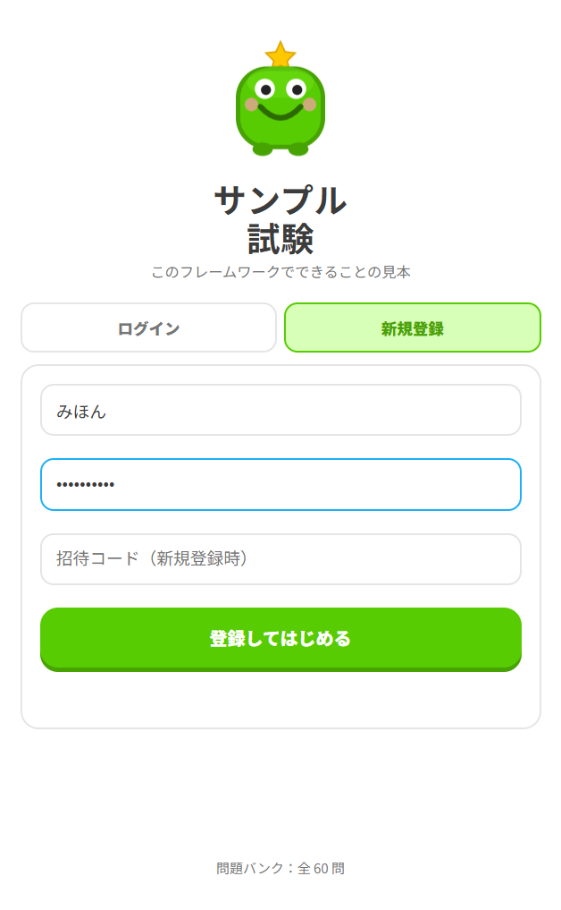

一度登録すれば、**どの問題を何回解いて、何回正解したか**がユーザーごとに記録される。
この記録が後述の「間違え優先」出題と成績画面の土台になる。

（配布元の設定によっては、新規登録に招待コードが要ることがある。
 公開デモとして動いている場合は、ボタン1つでお試し用ユーザーが作られることもある）

ログインするとホーム画面になる。

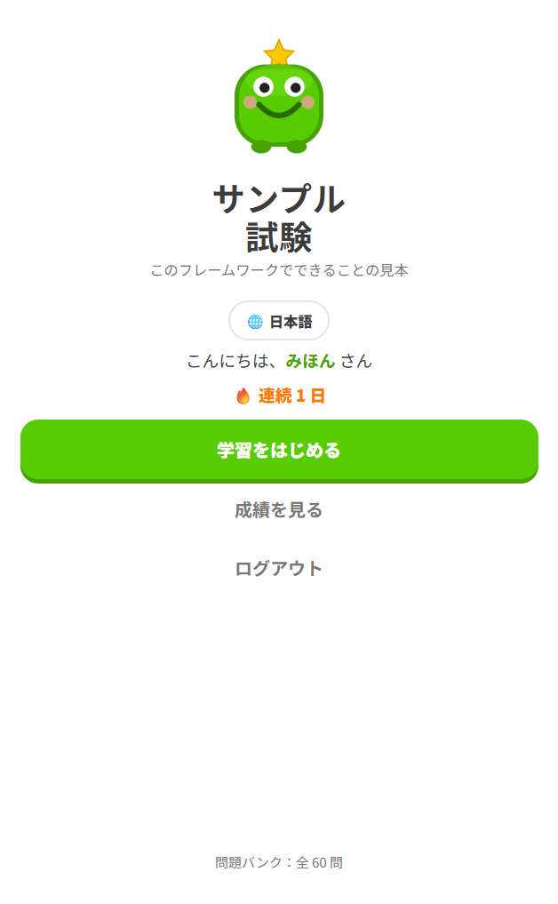

---

## 出題のしかたを選べる

「学習をはじめる」を押すと、**出題タイプ**と**セッション**の2つを選ぶ画面になる。

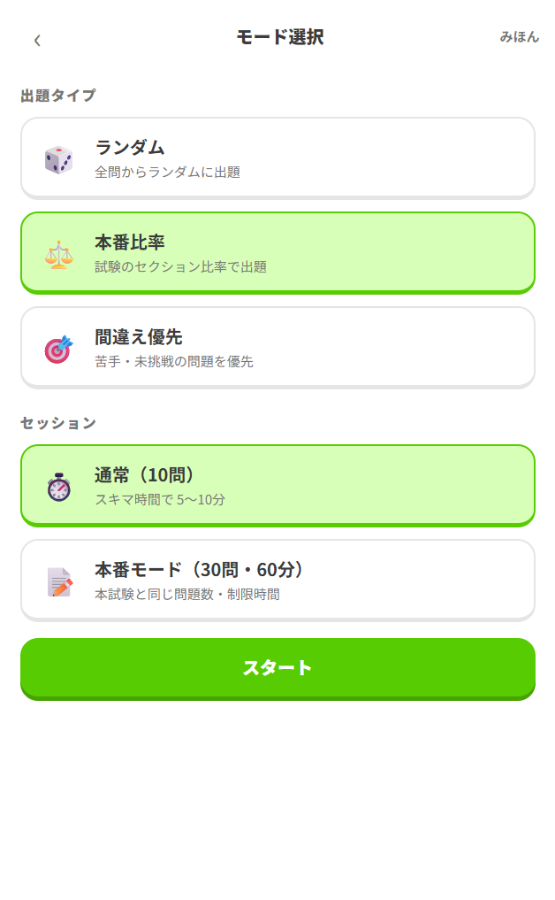

### 出題タイプ（どの問題を出すか）

| | |
|---|---|
| 🎲 **ランダム** | 全問からランダムに出題。とりあえず回したいとき |
| ⚖️ **本番比率** | 本試験と同じセクション比率で出題。実力を測りたいとき |
| 🎯 **間違え優先** | 間違えた問題・まだ解いていない問題を優先して出題。苦手潰し用 |

「間違え優先」は、これまでの誤答率・直近で間違えたか・挑戦回数が少ないかを見て並べ替えている。
解いたことのない問題が真っ先に出てくるので、問題プールを一周するのにも使える。

### セッション（どれだけ解くか）

| | |
|---|---|
| ⏱️ **通常** | 数問だけ。1問ごとにその場で正誤と解説が出る。スキマ時間向け |
| 📝 **本番モード** | 本試験と同じ問題数・制限時間。通しで解いて最後にまとめて採点 |

本番モードにはタイマーと**見直しフラグ**が付く。迷った問題にチェックを入れておくと、
最後の解答一覧から飛んで戻れる。出題は自動的に本番比率になる。

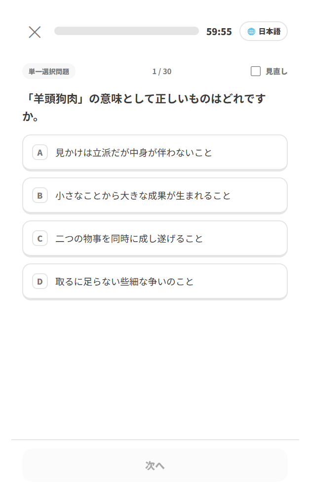

---

## いろいろな形式の問題を出せる

### 単一選択と複数選択

複数選択の問題は、**当てはまるものをすべて選んで完全に一致したときだけ正解**になる。
1つでも選び漏れたり、余計に選んだりすると誤答扱い。本試験と同じ厳しさで練習できる。

### 画像・音声・動画つきの問題

問題文・選択肢・解説のどれにも、画像や音声、動画を付けられる。
図を読む問題も、聞き取りの問題も、そのまま練習できる。

<table>
<tr>
<td width="50%">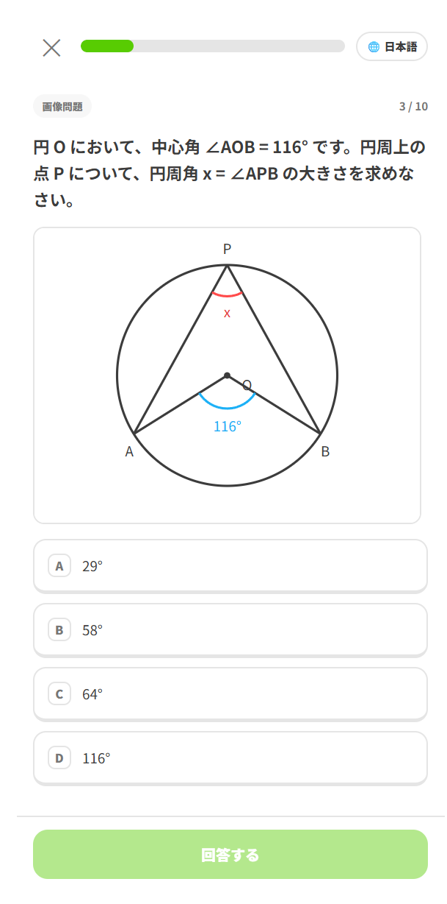</td>
<td width="50%">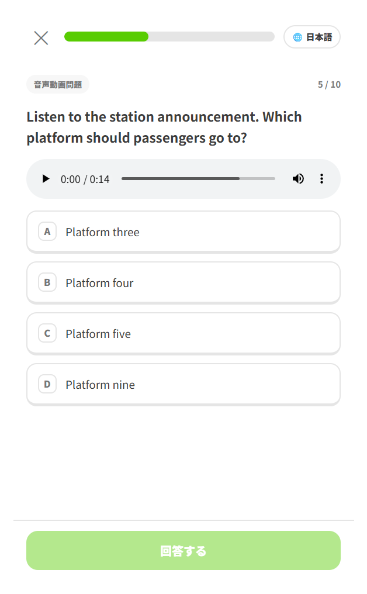</td>
</tr>
</table>

### 原文と訳文の切り替え

問題に訳文が用意されていれば、🌐 ボタンで原文（英語）と訳文を行き来できる。
回答の状態はそのままで文章だけが切り替わるので、詰まったときだけ訳を見る、という使い方ができる。
（訳文があるかどうかは試験によって違う）

---

## 間違えた問題をその場で潰せる

### 1問ごとの即フィードバック

通常セッションでは、回答するとすぐに正誤が出る。正解の選択肢は緑、選んだ誤答は赤、
複数選択で選び漏らした正解には「選び漏れ」のタグが付く。
「解説を見る」を開けば、なぜその答えになるのかをその場で読める。

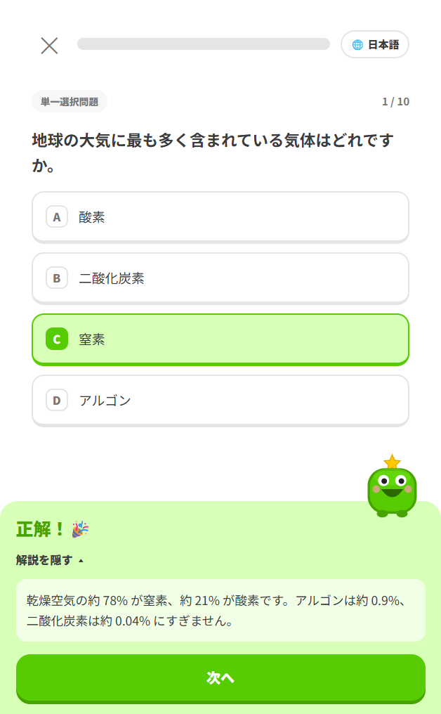

### 復習ループ ― 全問正解するまで再出題

セッションを解き終えたときに誤答があると、「復習する」を選べる。
間違えた問題だけがもう一度出題され、**それでも間違えた問題がさらに次のラウンドに回る**。
全部正解するまで終わらないので、その日の取りこぼしをゼロにして終われる。

<table>
<tr>
<td width="50%">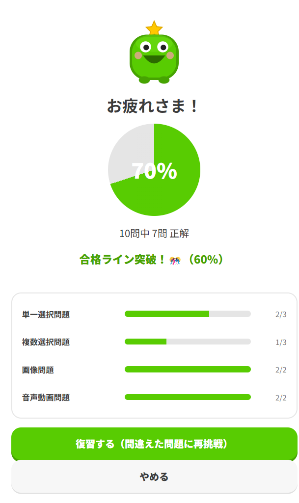</td>
<td width="50%">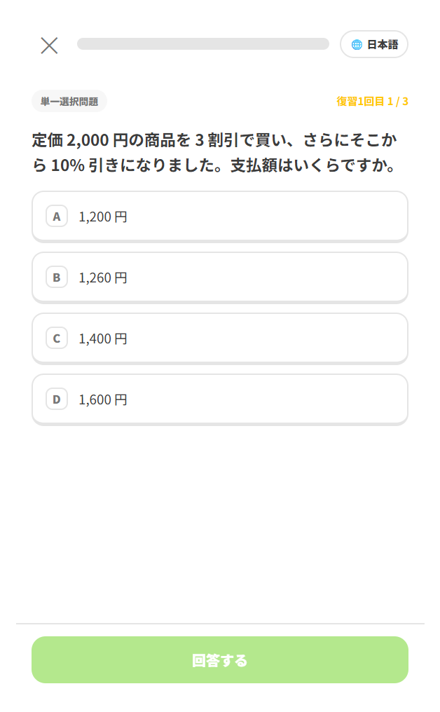</td>
</tr>
</table>

復習中の回答は成績に記録されない。正答率を気にせず、納得いくまで叩ける。

### 間違え見直し ― 誤答をまとめて読み返す

結果画面の「間違えた問題を復習」からは、そのセッションで間違えた問題が一覧で開く。
正解はどれか、自分は何を選んだか、何を選び漏れたか、そして解説が、1画面で縦に並ぶ。

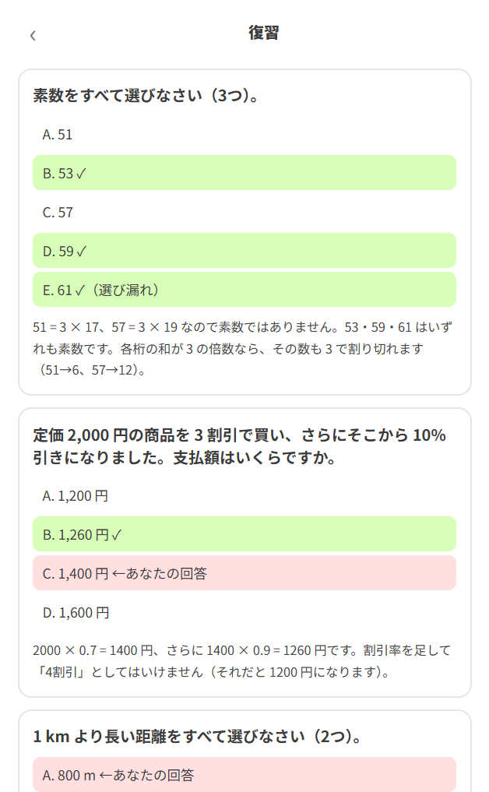

---

## 成績が数字で見える

### セッションごとの結果

解き終えると、正答率・合格ラインに届いたか・**セクション別の内訳**が出る。
どの分野で落としているかがその場で分かる。

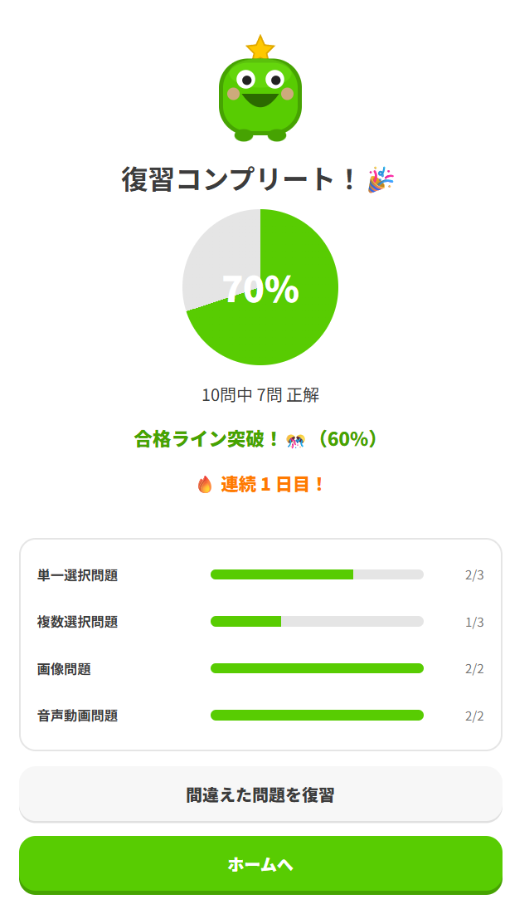

### 通算の成績

ホームの「成績を見る」からは、これまでの積み上げが見られる。

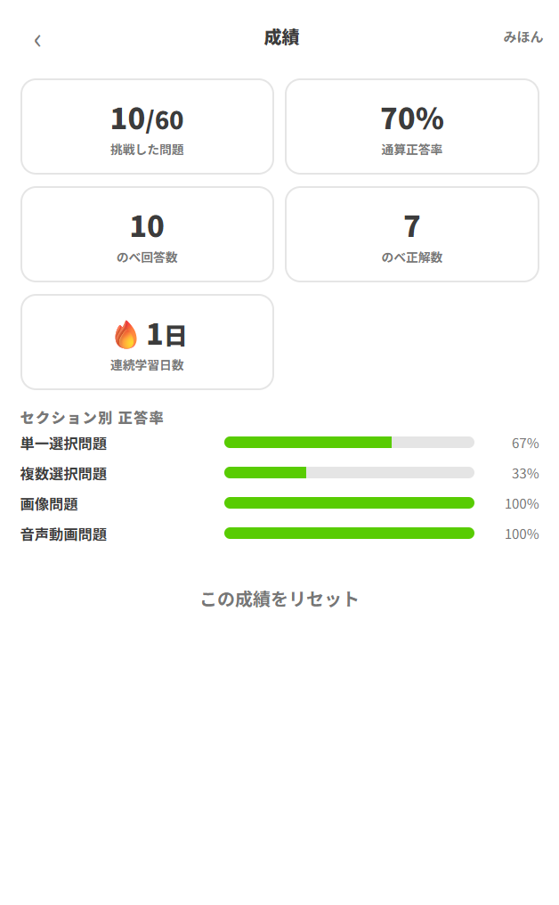

- **挑戦した問題 / 全問数** — 問題プールをどれだけ消化したか
- **通算正答率** — これまでの全回答での正答率
- **のべ回答数・のべ正解数**
- **連続学習日数**
- **セクション別 正答率** — 苦手分野の一覧

成績はいつでもリセットできる。一周して知識が付いたところで測り直すと、
定着度が正直に出る。使い方は［おすすめの学習方法］で詳しく書く。

---

## 毎日続けるとストリークが伸びる

1日に1回でもセッションを最後まで解き切ると、その日が「達成」になる。
連続した日数がホームと結果画面に 🔥 で表示され、節目には応援メッセージが出る。

毎日机に向かう理由づくりとして、これがいちばん効く。

---

## 途中でやめられる

急に時間がなくなっても大丈夫。✕ を押すと、

- **途中結果を見る** — そこまでの結果を見て終わる
- **記録せずにホームへ** — なかったことにして抜ける
- **続ける** — 中断をやめて戻る

の3つから選べる。

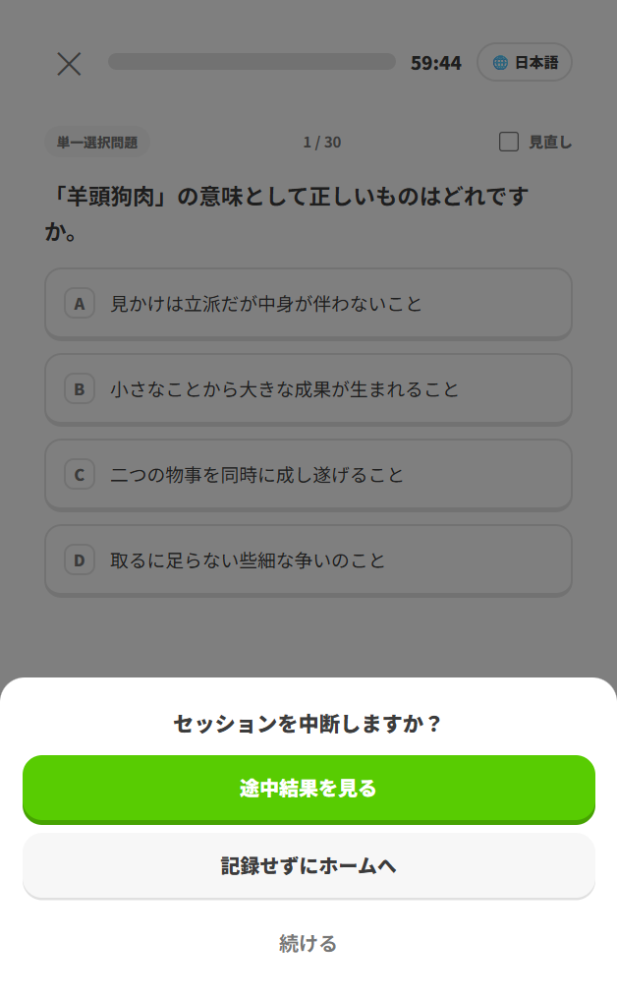

---

## スマホに入れて、電波がなくても解ける

ブラウザの「ホーム画面に追加」でアプリとして入れられる。一度開いておけば、
問題文も画像・音声もスマホ側に取り込まれるので、**電波の届かない場所でも問題を解ける**。

> ⚠ ただし成績の記録はサーバーに保存される。オフラインで解いた分は記録されないので、
> 成績を残したいときは通信できる状態で解くこと。

---

## 次に読む

- [ユーザーの登録](./sign-up.md)（準備中） — 登録の手順と、保存されるデータ
- [学習の開始](./getting-started.md)（準備中） — アクセスから成績の見方までの通し手順
- [おすすめの学習方法](./study-tips.md)（準備中） — 試験日から逆算した練習の組み立て方
